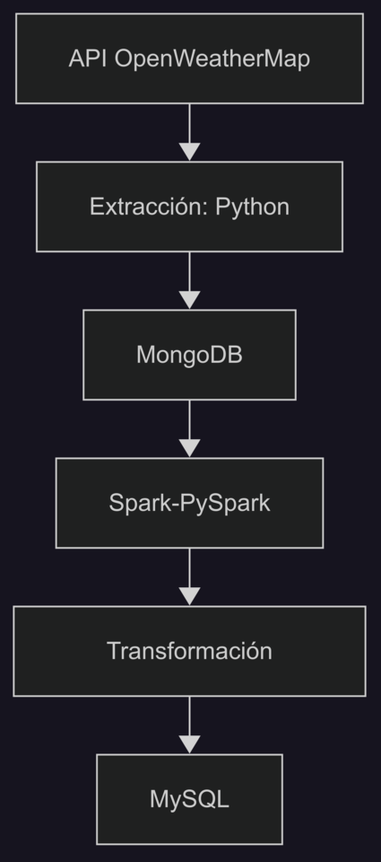

# 🌦️ Argentina-Capitals Weather ETL

End-to-end pipeline que extrae datos meteorológicos en tiempo real para **todas las capitales de provincia argentinas**, los almacena sin procesar en **MongoDB**, los transforma con **PySpark** y carga el dataset curado en **MySQL**. Orquestado con **Apache Airflow** y ejecutado en **Docker**.

---

## 📑 Tabla de contenidos

1. [Descripción general](#descripción-general)  
2. [Arquitectura](#arquitectura)  
3. [Instalación rápida](#instalación-rápida)  
4. [Estructura del proyecto](#estructura-del-proyecto)  
5. [Configuración](#configuración)  
6. [Modelo de datos](#modelo-de-datos)  

---

## 1. Descripción general

| Etapa   | Herramienta           | Detalle |
|---------|-----------------------|---------|
| **Extracción** | Python `requests` | Datos actuales desde [OpenWeatherMap](https://openweathermap.org/current) por cada capital. |
| **Carga raw** | MongoDB | Guarda JSON sin procesar; deduplicación por ciudad y ventana de 1 h. |
| **Transformación** | PySpark | Aplanar, Kelvin → Celsius, Unix → timestamp, zona horaria de Buenos Aires. |
| **Carga curada** | MySQL | Inserción incremental evitando duplicados mediante claves únicas `(id, date_time)`. |
| **Orquestación** | Airflow | 2 DAGs: `weather_ingest` (ciclo de una hora) y `weather_transform_load` (manual). |
| **Infraestructura** | Docker Compose | Mongo, MySQL, Postgres (metadatos Airflow) y Airflow.

---

## 2. Arquitectura


## 3. Instalación rápida

### Requisitos
- Docker ≥ 24 y Docker Compose ≥ v2  
- Clave gratuita de [OpenWeatherMap](https://home.openweathermap.org/api_keys)

### 1. Clonar y entrar
```bash
git clone https://github.com/tu-org/Argentina-Capitals-Weather-ETL.git
cd Argentina-Capitals-Weather-ETL
```
### 2. Crear .env
```bash
API_KEY=YOUR_OPENWEATHER_KEY

MYSQL_HOST=mysql
MYSQL_PORT=3306
MYSQL_DB=weather
MYSQL_USER=root
MYSQL_PASSWORD=password

MONGO_HOST=mongo
MONGO_PORT=27017
MONGO_DB=weather
MONGO_COLLECTION=raw_weather_data
```
### 3. Levantar todo

```bash
docker network create app-net
```

```bash
docker compose up --build -d
```

### 4. Ejecutar DAGs
* + UI Airflow http://localhost:8080  
  Usuario: `admin`  
  Contraseña: `admin`
* Activar y lanzar `weather_ingest` -> Datos sin procesar en MongoDB
* Lanzar `weather_transform_load` -> Datos transformados en MySQL

## 4. Estructura del proyecto
```md
Argentina-Capitals-Weather-ETL/
├── dags/
│   ├── weather_ingest_dag.py
│   └── weather_transform_load_dag.py
│
├── sql/
│   └── create_weather_table.sql
│
├── plugins/
│   └── operators/
│       ├── extract_operator.py
│       ├── load_operator.py
│       ├── wait_mysql_operator.py
│       └── mysql_ddl_operator.py
│
├── src/
│   ├── extract.py
│   ├── transform.py
│   ├── load.py
│   ├── mysql_utils.py
│   └── utils.py
│
├── spark_jobs/
│   ├── transform_weather_job.py
│   └── load_to_mysql_job.py
│
├── config/
│   ├── argentina_locations.json
│   ├── config_loader.py
│   ├── mongo_config.py
│   └── spark_config.py
│
├── docker/
│   └── airflow.Dockerfile
│
├── Dockerfile
├── docker-compose.yml
├── .dockerignore
├── requirements.txt
├── requirements-airflow.txt
└── README.md
```
## 5. Configuración
| Archivo                           | Propósito                                  |
| --------------------------------- | ------------------------------------------ |
| `config/argentina_locations.json` | Lista estática de 23 capitales con lat/lon |
| `.env`                            | Credenciales y variables de entorno        |
| `docker-compose.yml`              | Servicios y puertos                        |

## 6. Modelado de datos

### Raw (MongoDB)
```json
{
  "coord": {
    "lon": -57.9544,
    "lat": -34.9214
  },
  "weather": [
    {
      "id": 800,
      "main": "Clear",
      "description": "clear sky",
      "icon": "01n"
    }
  ],
  "base": "stations",
  "main": {
    "temp": 280.85,
    "feels_like": 280,
    "temp_min": 280.85,
    "temp_max": 280.85,
    "pressure": 1022,
    "humidity": 66,
    "sea_level": 1022,
    "grnd_level": 1020
  },
  "visibility": 10000,
  "wind": {
    "speed": 1.66,
    "deg": 259,
    "gust": 2.24
  },
  "clouds": {
    "all": 0
  },
  "dt": 1752801398,
  "sys": {
    "country": "AR",
    "sunrise": 1752749756,
    "sunset": 1752785978
  },
  "timezone": -10800,
  "id": 3432043,
  "name": "La Plata",
  "cod": 200,
  "province": "Buenos Aires"
}
```
### Curated (MySQL)
| Columna               | Tipo                       |
| --------------------- | -------------------------- |
| `id`                  | INT                        |
| `city_name`           | VARCHAR(40)                |
| `province`            | VARCHAR(40)                |
| `country`             | CHAR(2)                    |
| `latitude`            | DOUBLE                     |
| `longitude`           | DOUBLE                     |
| `temperature`         | DOUBLE                     |
| `feels_like`          | DOUBLE                     |
| `temp_min`            | DOUBLE                     |
| `temp_max`            | DOUBLE                     |
| `humidity`            | INT                        |
| `pressure`            | INT                        |
| `wind_speed`          | DOUBLE                     |
| `wind_deg`            | INT                        |
| `cloudiness`          | INT                        |
| `weather_main`        | VARCHAR(40)                |
| `weather_description` | VARCHAR(100)               |
| `visibility`          | INT                        |
| `sunrise_ts`          | TIMESTAMP                  |
| `sunset_ts`           | TIMESTAMP                  |
| `date_time`           | TIMESTAMP                  |
| **PK**                | `(id, date_time)` |
